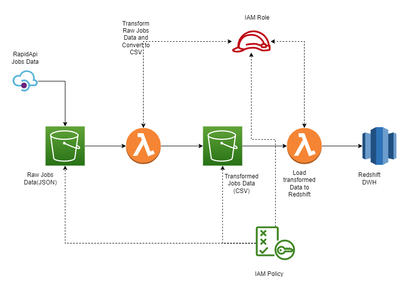
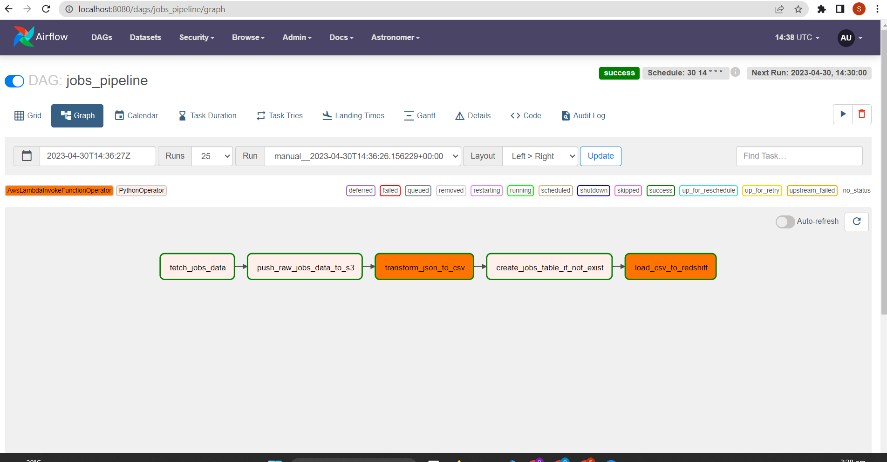
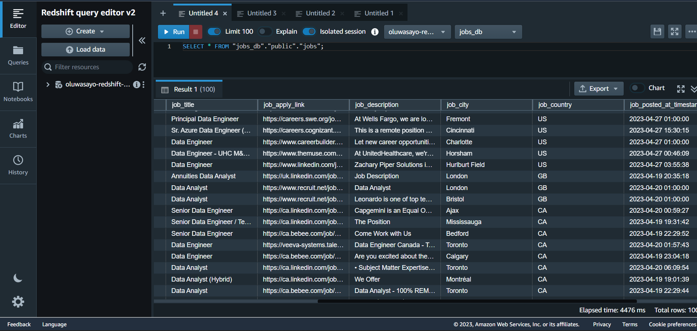

# Jobs Data Pipeline

This repo contains code used in building a data infrastructure
solution that provides daily job update on our job board.

## Architecture


## Project Setup

- To run the code and queries locally, clone the repo and create your virtual environment, then install the required python libraries in the virtual environment using the command below:

```bash
pip install -r requirements.txt
```

- Create a `.env` file and supply the environment variables listed in the [.env.example](.env.example) file together with thier corresponding values

- Run the [python script](./main.py) to run the `extract`, `transform` and `load` steps of the pipeline. There are two ways in which the etl pipeline can be executed. The first is by executing the command

```bash
python main.py
```
and the second is by adding the `--use-lambda` flag as in
```bash
python main.py --use-lambda
```
This will invoke the lambda functions on AWS. The lambda functions have been deployed using the serverless framework, hence the need for a `serverless.yml` file. More information will be provided on deploying the lambdas from your machine using the serverless cli commands. For now, the first method should work just fine (assuming all the above steps have been followed).

## Orchestration wih airflow
To orchestrate the pipeline locally using airflow, you need to have `docker` and `astro` installed on your machine. Once in the root folder which contains the [Dockerfile](./Dockerfile), run the command

```bash
astro dev start
```

After a few minutes, navigate to `http://localhost:8080`. You should be directed to a login screen, enter `admin` and `admin` as your username and password and you will be redirected to the airflow dashboard with a table containing a single pipeline with the name [job_pipeline](./dags/job_pipeline.py). Clicking oon the pipeline and the the graph view should display thepage shown below



It is apparent that the pipeline in the airflow view represents the pipeline shown in the architectural diagram.

## Result

